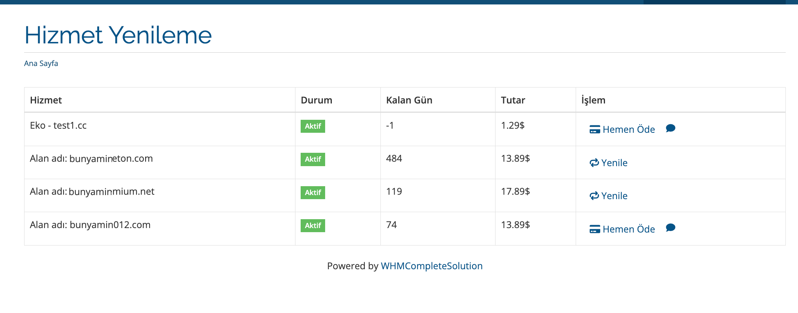
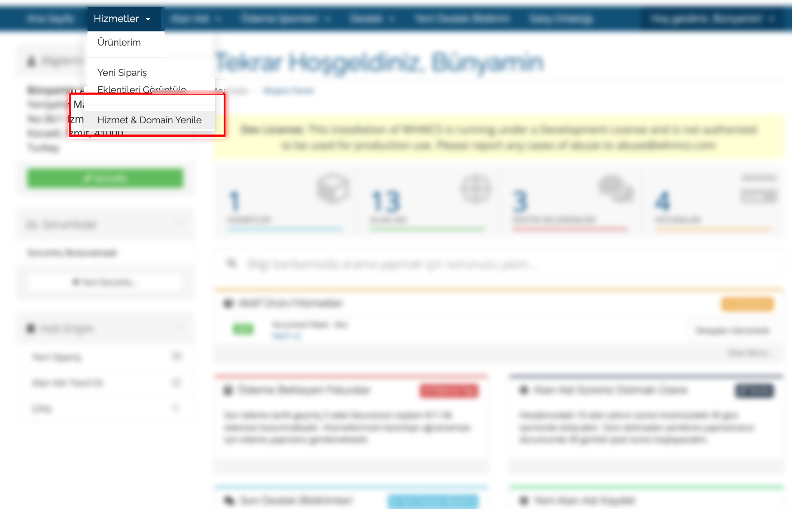
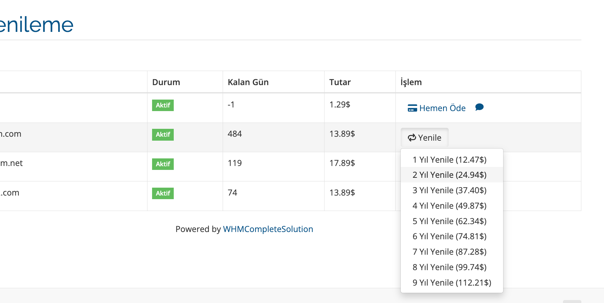
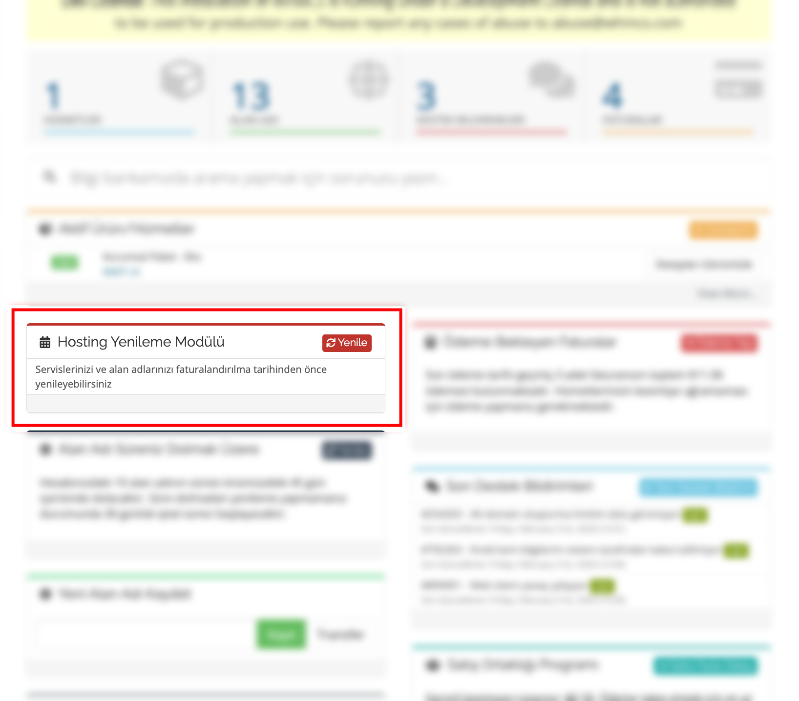
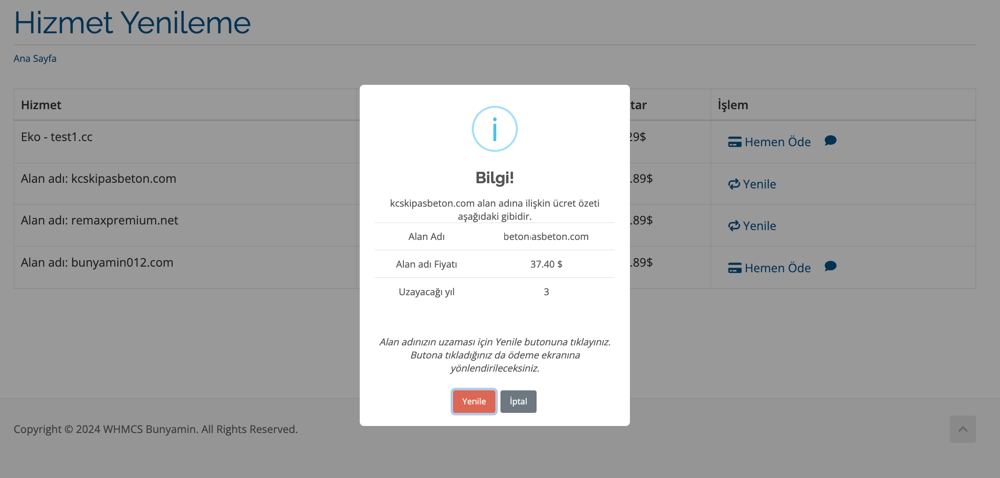

# Hosting ve Domain Yenileme Modülü

Bu WHMCS modülü, hosting ve domain hizmetlerinin bitiş tarihinden önce müşterilerin bu hizmetleri kolayca yenileyebilmelerine olanak tanır.

## Özellikler

- **Müşteri Paneli Entegrasyonu:** Müşteriler, müşteri paneli panolarında kolayca hizmet ve alan adlarını yenileyebilir.
- **Tek Ekrandan Yenileme:** Alan adları ve hizmetler için tek bir ekrandan yenileme işlemlerini gerçekleştirme imkanı.
- **Esnek Ayarlar:** Admin panelinden, müşteri panelindeki yenileme seçeneklerini yönetme imkanı.
- **Yerleşik Menü Seçenekleri:** Servis menüsünde, alan adı detay yan menüsünde ve hosting yan menüsünde yenileme seçenekleri.

## Kurulum

1. Modül dosyalarını `/modules/addons/` dizinine kopyalayın.
2. WHMCS Admin Paneli'ne gidin ve **Setup > Addon Modules** altından modülü bulun.
3. "Hosting ve Domain Yenileme Modülü"nü etkinleştirin ve yapılandırın.

## Yapılandırma

Modül, admin panelinden kolayca yapılandırılabilir. **Addon Modules** altında modülü etkinleştirdikten sonra, modül ayarlarına erişebilirsiniz:

- Yenileme seçeneklerinin müşteri panelinde gösterilip gösterilmeyeceğini seçin.
- Hangi hizmetlerin ve alan adlarının yenilenebileceğini belirleyin.

## Kullanım

Müşteriler, müşteri panelindeki ilgili menüler aracılığıyla hizmetlerini ve alan adlarını kolayca yenileyebilirler. Yenileme seçenekleri, modül ayarlarına göre dinamik olarak gösterilir.

## Destek

Sorularınız veya destek ihtiyaçlarınız için, lütfen [bunyamin@bunyam.in](mailto:bunyamin@bunyam.in) adresine e-posta gönderin

## Ekran Görüntüleri

  

