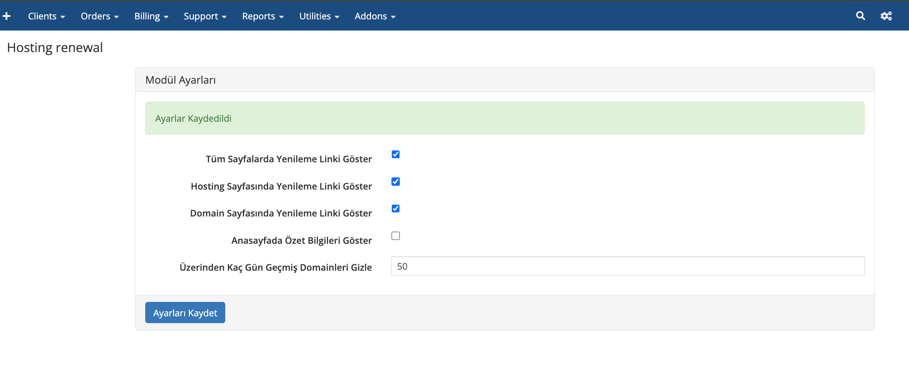
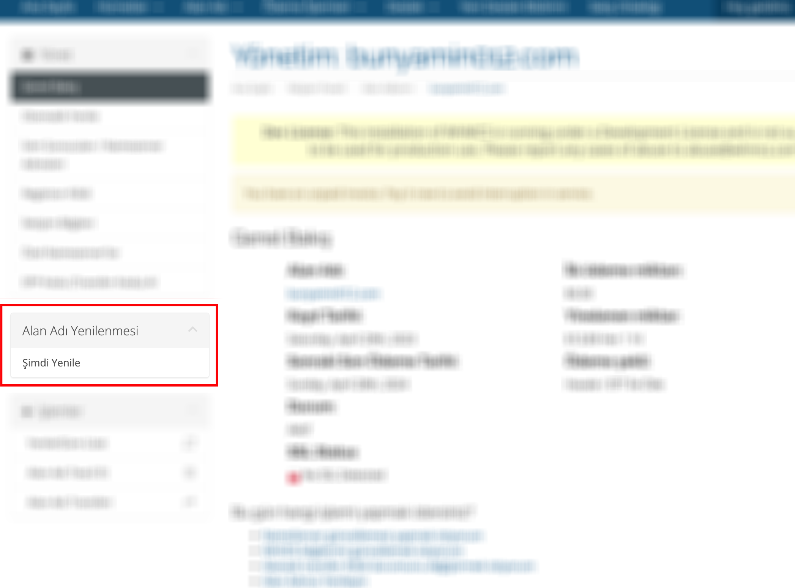
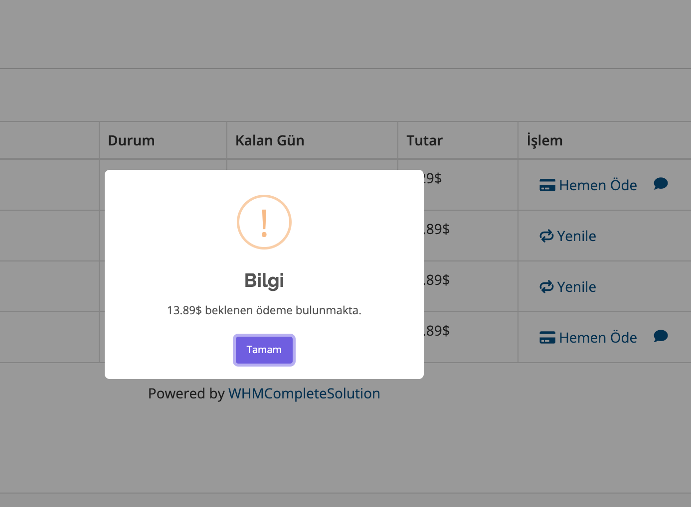
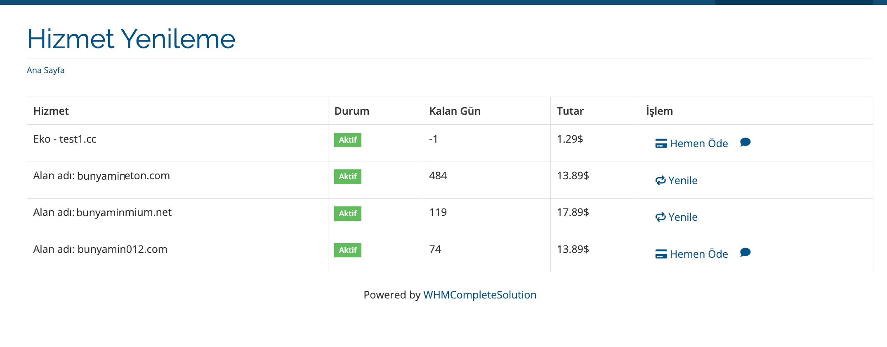
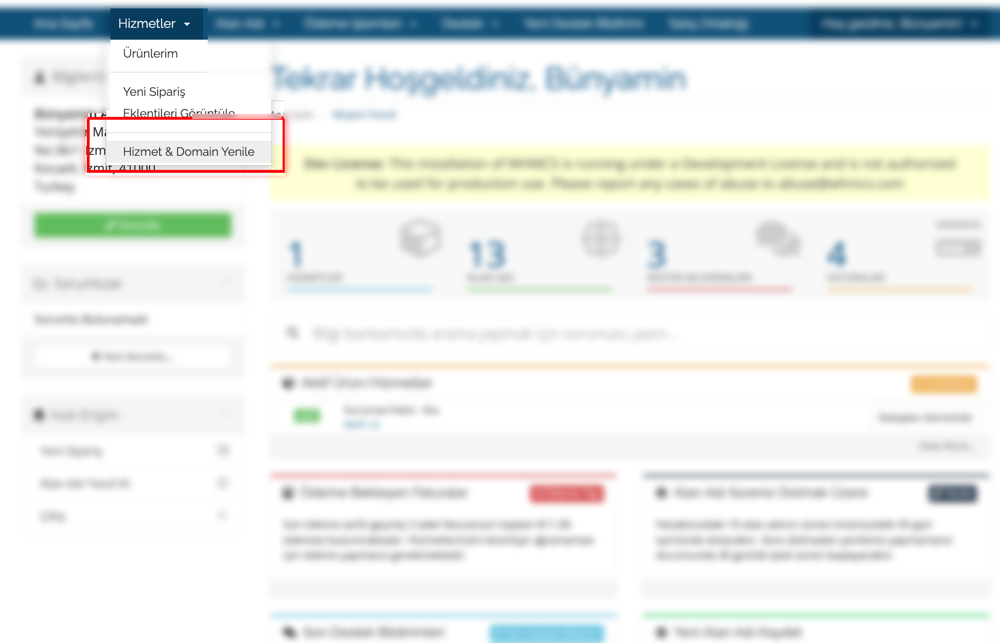
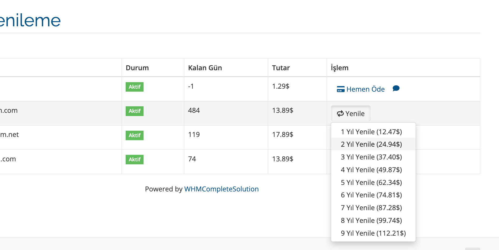
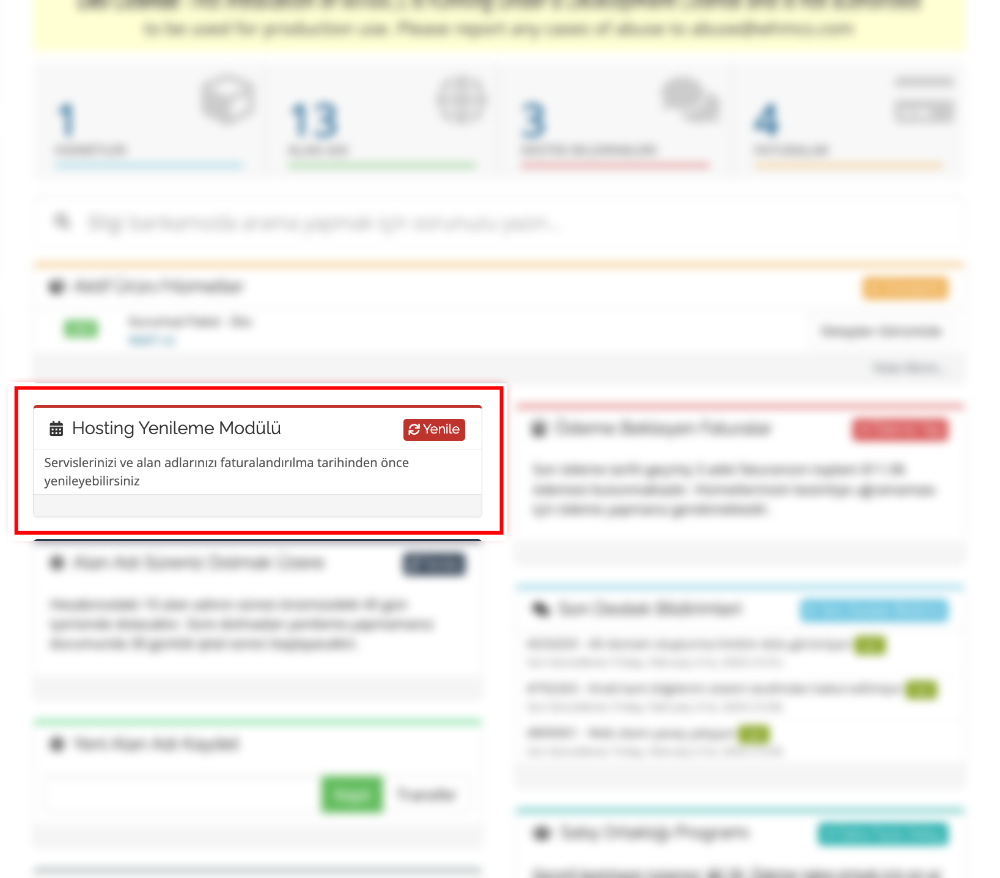
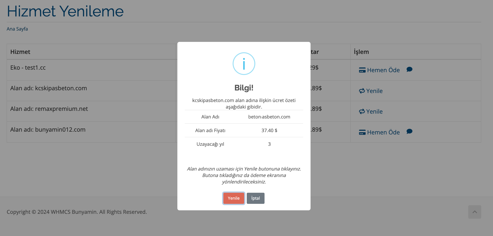
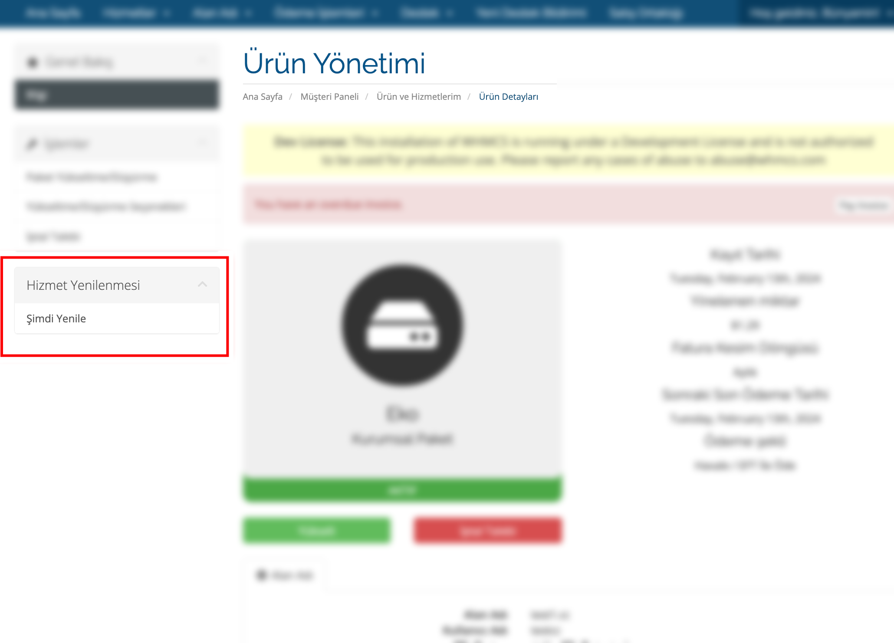

  
  <a href="README.md">  EN </a> 
  <a href="README-TR.md"   >  |  TR </a>  

# Hosting and Domain Renewal Module

This WHMCS module enables customers to easily renew their hosting and domain services before their expiration dates.

## Features

- **Client Panel Integration:** Customers can effortlessly renew their services and domains directly from the client panel dashboards.
- **One-Screen Renewal:** Offers the ability to renew both services and domains from a single screen.
- **Flexible Settings:** Administrators can manage renewal options in the client panel from the admin area.
- **Embedded Menu Options:** Renewal options are available in the service menu, domain detail sidebar, and hosting sidebar.

## Installation

1. Copy the module files to the `/modules/addons/` directory.
2. Go to the WHMCS Admin Panel and locate the module under **Setup > Addon Modules**.
3. Activate and configure the "Hosting and Domain Renewal Module".

## Configuration

The module can be easily configured from the admin panel. After activating the module under **Addon Modules**, you can access the module settings:

- Choose whether renewal options should be displayed in the client panel.
- Specify which services and domains can be renewed.

## Usage

Customers can renew their services and domains through the relevant menus in the client panel. Renewal options are dynamically displayed based on module settings.

## Support

For questions or support needs, please email  [bunyamin@bunyam.in](mailto:bunyamin@bunyam.in) 

## Screenshots

  

